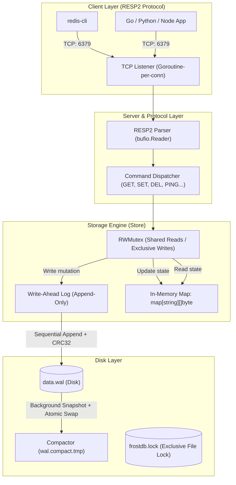
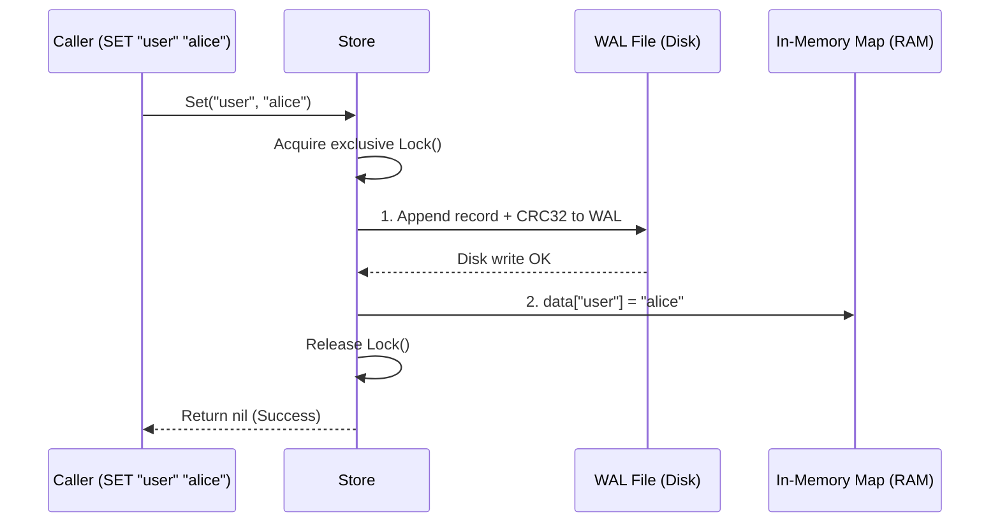
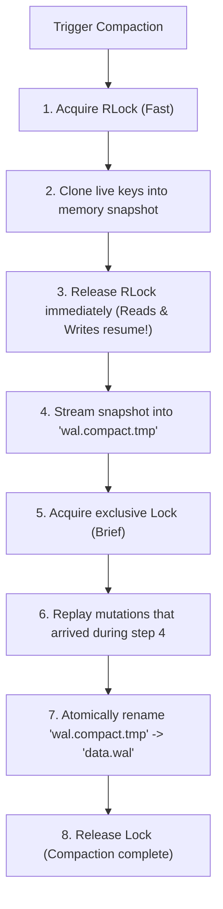
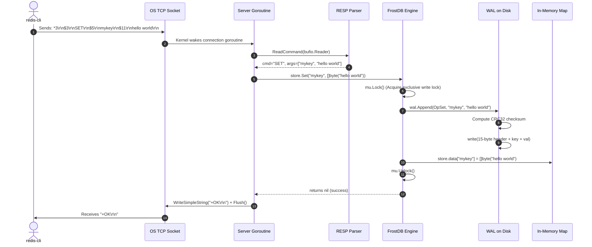

# FrostDB Internals: How It Works Under The Hood

This document is an in-depth architectural guide to **FrostDB**. It explains every subsystem, data structure, disk layout, concurrency guarantee, and engineering trade-off from first principles.

Whether you want to understand how databases survive power loss, how Redis-compatible servers parse bytes, or how zero-downtime log compaction works, this guide breaks it down step by step.

---

## Table of Contents

1. [High-Level Architecture](#1-high-level-architecture)
2. [Pillar 1: In-Memory Engine & Concurrency](#2-pillar-1-in-memory-engine--concurrency)
3. [Pillar 2: Durability & The Write-Ahead Log (WAL)](#3-pillar-2-durability--the-write-ahead-log-wal)
4. [Pillar 3: Zero-Downtime Log Compaction](#4-pillar-3-zero-downtime-log-compaction)
5. [Pillar 4: Redis RESP2 Networking Layer](#5-pillar-4-redis-resp2-networking-layer)
6. [Cross-Platform System Engineering (POSIX vs Windows)](#6-cross-platform-system-engineering-posix-vs-windows)
7. [Step-by-Step Life of a Request](#7-step-by-step-life-of-a-request)
8. [Design Trade-offs & Comparisons](#8-design-trade-offs--comparisons)

---

## 1. High-Level Architecture

FrostDB is an **in-memory, write-ahead-logged (WAL) embedded and client-server key-value database**.

At a glance, FrostDB sits between purely ephemeral caches (like Memcached) and disk-heavy LSM-tree / B-tree engines (like RocksDB or SQLite):
- **Reads** are served directly from RAM (sub-microsecond latency, $O(1)$ lookup).
- **Writes** update RAM only *after* appending to a durable disk log (the WAL).
- **Network clients** interact with it using standard Redis commands (`SET`, `GET`, `DEL`, etc.) over raw TCP.



---

## 2. Pillar 1: In-Memory Engine & Concurrency

### The Core Data Structure
The in-memory data store is defined in [`internal/engine/store.go`](file:///Users/frost/Desktop/frostdb/internal/engine/store.go):

```go
type Store struct {
    mu       sync.RWMutex
    data     map[string][]byte
    wal      *WAL
    fileLock *FileLock
    // ...
}
```

#### Why `sync.RWMutex`?
A standard `sync.Mutex` blocks all goroutines, even if all of them are merely reading values. 

Real-world database workloads are often **80-95% reads** and **5-20% writes**. With `sync.RWMutex`:
- **Multiple readers (`mu.RLock()`)** can read simultaneously across multiple CPU cores with zero lock contention.
- **Writers (`mu.Lock()`)** acquire exclusive access, blocking incoming readers and other writers until the mutation completes.

#### Why `[]byte` instead of `string`?
Storing values as `[]byte` allows FrostDB to store arbitrary binary payloads—JSON, protobufs, compressed blobs, or raw images—without Unicode or UTF-8 validation overhead. When retrieving values, FrostDB returns byte slices, avoiding unnecessary heap allocations.

---

## 3. Pillar 2: Durability & The Write-Ahead Log (WAL)

### The Fundamental Dilemma: Speed vs Durability
- **RAM is volatile**: If power fails or the OS crashes, RAM contents vanish.
- **Random disk writes are slow**: Updating an on-disk index (like a B-Tree) requires seeking to random disk blocks, creating severe I/O bottlenecks.

### The Solution: Sequential Append-Only Logging
The Write-Ahead Log writes every mutation sequentially to the end of a file before applying it to the in-memory map. Sequential disk writes can exceed **500MB/s - 2GB/s** on modern NVMe drives because the disk never needs to search or relocate existing blocks.



If the machine crashes at step 1: RAM is lost, but the WAL on disk has the record. On restart, FrostDB replays the WAL from byte 0 and reconstructs the exact state.

---

### The Binary Record Wire Format

Each record in [`internal/engine/record.go`](file:///Users/frost/Desktop/frostdb/internal/engine/record.go) is framed with a strict binary header:

```text
+-------------------+----------------+--------------------+--------------------+--------------------+-------------------------------+
| Magic Bytes (2B)  | OpType (1B)    | KeyLen (4B uint32) | ValLen (4B uint32) | CRC32 (4B uint32)  | Payload (Key bytes + Val bytes)|
| 0x46 0x44 ("FD")  | 1=SET, 2=DEL   | Big-Endian uint32  | Big-Endian uint32  | IEEE Checksum      | Variable length               |
+-------------------+----------------+--------------------+--------------------+--------------------+-------------------------------+
|<----------------------------- 15 Bytes Header ---------------------------------->|<------- KeyLen + ValLen Bytes ------->|
```

1. **Magic Bytes (`0x4644` - ASCII "FD" for FrostDB)**:
   Acts as a watermark. If someone tries to open a non-FrostDB file as a WAL, it fails immediately instead of attempting to decode random garbage.
2. **OpType (1 Byte)**:
   - `0x01` = `OpSet`
   - `0x02` = `OpDelete`
   - `0x03` = `OpClear`
3. **KeyLen & ValLen (4 Bytes each, Big-Endian)**:
   Tells the decoder exactly how many bytes to allocate and read for the key and value.
4. **CRC32 (4 Bytes, IEEE Table)**:
   A cyclic redundancy checksum computed across the `OpType`, `KeyLen`, `ValLen`, `Key`, and `Value`. 
   - Protects against **bit rot** (disk corruption).
   - Detects **torn writes** (when power dies mid-write, leaving a truncated record).

---

### Torn-Write Recovery
What happens if the system loses power halfway through writing a record?

```text
[ Record 1 (Valid) ] [ Record 2 (Valid) ] [ Record 3: 15B Header + ONLY 3 BYTES OF VALUE ] <CRASH!>
```

When FrostDB restarts and calls `wal.Replay()`:
1. It parses Record 1: Checksum matches. Replayed.
2. It parses Record 2: Checksum matches. Replayed.
3. It encounters Record 3: Decoding hits `io.ErrUnexpectedEOF` or `ErrCorruptRecord` (checksum mismatch).
4. FrostDB automatically calls `file.Truncate(validOffset)`, cutting off the damaged tail.
5. The file is clean, valid, and ready for new writes.

---

### Sync Policies: Balancing Safety and Speed

Configured via `engine.SyncPolicy`:

| Policy | Behavior | Latency | Durability Guarantee |
| :--- | :--- | :--- | :--- |
| `SyncNone` | Writes go to OS page cache. Disk syncs when OS flushes dirty pages. | < 1 µs | Vulnerable to power loss (last ~1-30s lost). Safe against app crashes. |
| `SyncPeriodic` | A background goroutine calls `fsync()` every 1 second (default). | ~ 1-5 µs | At most 1 second of data loss on total hardware power loss. |
| `SyncAlways` | Every single write calls `file.Sync()` (`fsync` syscall) before returning. | ~ 500-2000 µs | **Zero data loss**. Every acknowledged write is physically on persistent storage. |

---

## 4. Pillar 3: Zero-Downtime Log Compaction

### The Problem: Infinite Log Growth
Because the WAL is append-only, updating the same key 1,000,000 times writes 1,000,000 records. The file might grow to 100 MB, even though only 1 key is alive. Replaying it on startup would take seconds.

### The Naive (Bad) Approach
Freeze the entire database, lock all reads and writes, iterate the memory map, write a new file, and unlock. If the database has 10 million keys, clients freeze for several seconds.

### FrostDB's Solution: Background Snapshot + Atomic Rename
Implemented in [`internal/engine/compaction.go`](file:///Users/frost/Desktop/frostdb/internal/engine/compaction.go):



1. **Point-in-Time Snapshot**:
   We acquire a read lock (`mu.RLock()`), shallow-copy the pointers in `data` to a temporary slice, and immediately release the read lock (takes < 1ms).
2. **Background Serialization**:
   While live traffic continues writing new records to the active WAL, a background writer encodes the snapshot records into a sibling file named `wal.compact.tmp`.
3. **Catch-Up & Atomic Swap**:
   FrostDB briefly acquires the write lock, copies any records appended to the old WAL while step 2 was running, closes the old WAL file, and invokes `os.Rename("wal.compact.tmp", "data.wal")`.
   - On POSIX and Windows, `os.Rename` replaces the target file atomically.
   - Operating systems guarantee that readers never see a partially swapped file.

---

## 5. Pillar 4: Redis RESP2 Networking Layer

FrostDB runs an embedded TCP server speaking **RESP2 (REdis Serialization Protocol v2)**, allowing standard Redis clients to connect out of the box.

### The RESP2 Wire Protocol Format
RESP2 encodes types using the first byte:

| Byte Prefix | Type | Example Wire Format | Parsed Value |
| :--- | :--- | :--- | :--- |
| `+` | Simple String | `+OK\r\n` | `"OK"` |
| `-` | Error | `-ERR unknown command\r\n` | `error("unknown command")` |
| `:` | Integer | `:42\r\n` | `42` |
| `$` | Bulk String | `$5\r\nhello\r\n` | `"hello"` (binary safe) |
| `$-1` | Null Bulk String | `$-1\r\n` | `nil` (key not found) |
| `*` | Array | `*2\r\n$3\r\nGET\r\n$3\r\nfoo\r\n` | `["GET", "foo"]` |

### Streaming Parser Architecture
In [`internal/protocol/resp.go`](file:///Users/frost/Desktop/frostdb/internal/protocol/resp.go), FrostDB uses a `bufio.Reader` with zero intermediate allocations for framing:
- If a client sends standard RESP arrays (like Redis client libraries do), `ReadCommand()` decodes the array.
- If a human connects via `telnet` or `nc` and types `SET foo bar\r\n`, the parser falls back to **inline command parsing**, splitting tokens by whitespace automatically!

### Concurrent TCP Server Architecture
In [`internal/server/server.go`](file:///Users/frost/Desktop/frostdb/internal/server/server.go):

```go
func (s *Server) handleConn(conn net.Conn) {
    defer conn.Close()
    reader := bufio.NewReader(conn)
    writer := bufio.NewWriter(conn)
    for {
        cmd, args, err := protocol.ReadCommand(reader)
        // ... dispatch to store ...
        // ... write RESP response ...
        writer.Flush()
    }
}
```
- Each client connection is handled by an independent, lightweight **Go routine** (stack cost ~2KB).
- 10,000 concurrent client connections require only ~20-30MB of RAM.

---

## 6. Cross-Platform System Engineering (POSIX vs Windows)

During CI matrix testing, we resolved two low-level OS incompatibilities:

### 1. File Locking (`flock`)
To prevent two FrostDB processes from opening the same data directory and corrupting the WAL, FrostDB acquires an exclusive file lock on `frostdb.lock`.

- **POSIX (Linux / macOS)**: Implemented via `syscall.Flock(fd, syscall.LOCK_EX|syscall.LOCK_NB)`.
- **Windows**: Windows does not have the `flock` syscall. 
  - Instead, we call `kernel32.dll` directly via `windows.LockFileEx` with flags `LOCKFILE_EXCLUSIVE_LOCK | LOCKFILE_FAIL_IMMEDIATELY` on an overlapping range of `0xFFFFFFFF` bytes.
  - On shutdown, `windows.UnlockFileEx` cleanly releases the lock.

### 2. The Windows `O_APPEND` Truncation Trap
On Windows, opening a file with `os.O_APPEND`:
- In the Go Windows runtime, `O_APPEND` strips the Win32 `GENERIC_WRITE` flag and only grants `FILE_APPEND_DATA`.
- Win32's `SetEndOfFile()` (which Go's `file.Truncate()` calls) **strictly requires `GENERIC_WRITE`**.
- Calling `Truncate()` to remove torn writes at the end of the log failed on Windows with `Access is denied`.
- **Fix**: Open the WAL with `os.O_CREATE | os.O_RDWR` and seek to `io.SeekEnd`. This grants `GENERIC_WRITE`, allowing both sequential appends and log truncation on all operating systems.

---

## 7. Step-by-Step Life of a Request

Let's trace what happens when an application executes:
```bash
redis-cli -p 6379 SET mykey "hello world"
```



1. `redis-cli` sends the RESP-encoded array over TCP port 6379.
2. The server goroutine reading the connection passes the stream to `protocol.ReadCommand`.
3. The parser extracts the command and arguments without copying strings unnecessarily.
4. The server dispatches to `store.Set()`.
5. `store.Set()` locks the `sync.RWMutex`.
6. `wal.Append()` constructs the binary record, computes the CRC32 checksum, and writes bytes sequentially to disk.
7. If `SyncAlways` is configured, `file.Sync()` flushes the disk controller write cache.
8. The key and value byte slice are inserted into the Go `map[string][]byte`.
9. The write lock is released.
10. The server writes `+OK\r\n` back through the buffered writer to the client socket.

---

## 8. Design Trade-offs & Comparisons

| Dimension | FrostDB | Redis | SQLite | RocksDB / LevelDB |
| :--- | :--- | :--- | :--- | :--- |
| **Primary Storage** | In-Memory (`map[string][]byte`) | In-Memory (dict) | B-Tree on Disk / Page Cache | LSM-Tree (SSTables on Disk) |
| **Durability** | Write-Ahead Log (WAL) | AOF (Append-Only File) / RDB | Rollback Journal / WAL | WAL + MemTable + SSTables |
| **Protocol** | Redis RESP2 + Native Go API | Redis RESP2 / RESP3 | C / SQL API | C++ / Key-Value API |
| **Dependencies** | **Zero** (Pure Go standard library) | C runtime | C runtime | C++ runtime |
| **Max Dataset Size** | Available System RAM | Available System RAM | Disk capacity (terabytes) | Disk capacity (terabytes) |
| **Read Latency** | Sub-microsecond (direct pointer) | Sub-microsecond (single-threaded) | Microseconds (B-Tree traversal) | Microseconds (Bloom filter + SST search) |
| **Compaction** | Background Snapshot + Atomic Swap | Background rewrite (`BGREWRITEAOF`) | `VACUUM` | Multi-level background merge |

### When to Use FrostDB:
- As an **embedded cache or state store** inside a Go microservice where you don't want to run or manage an external Redis cluster.
- As a **lightweight Redis replacement** in tests, local development, or edge devices (Raspberry Pi, IoT) where minimal memory and zero external dependencies matter.
- When you need **predictable sub-microsecond reads** with guaranteed persistence across process restarts.
